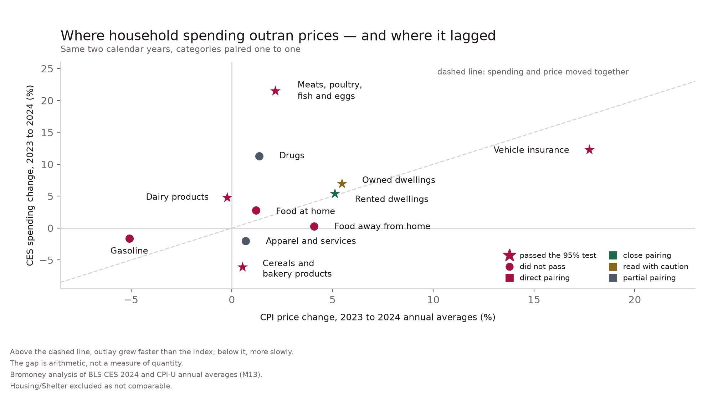
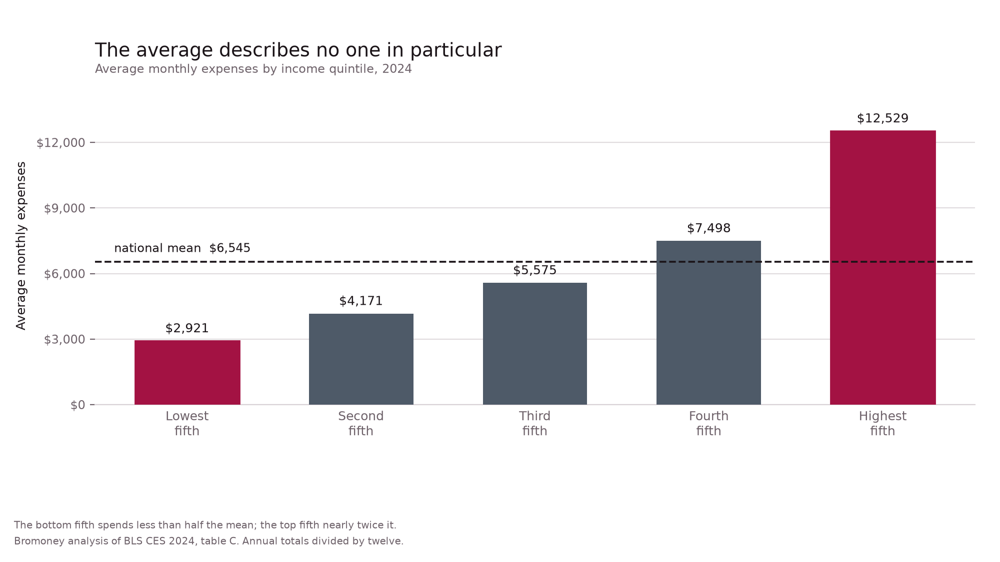
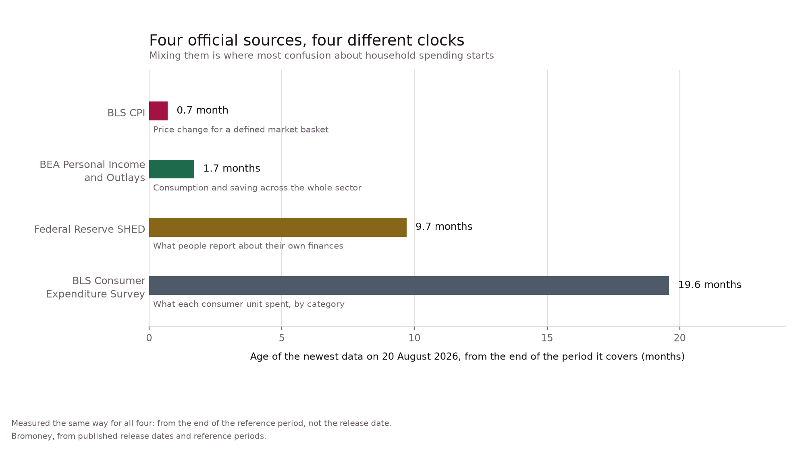

# Average U.S. Household Expenses and Price Pressure

Reproducible data, methods, and visualizations supporting Bromoney's research article, [*What Average Household Expenses Show About Price Pressure — and What They Can't*](https://bromoney.com/en/blog/average-household-expenses).

The study combines the latest official releases available when the analysis was checked on **August 20, 2026**:

- Bureau of Labor Statistics Consumer Expenditure Survey: calendar 2024;
- BLS Consumer Price Index: through July 2026;
- Bureau of Economic Analysis Personal Income and Outlays: June 2026;
- Federal Reserve Survey of Household Economics and Decisionmaking: 2025 survey.

The original reproducible computation in this repository is the category-level **CES–CPI crosswalk for 2023–2024**. It compares spending and prices over the same two calendar years. The broader article uses the newer releases above to describe current conditions and the age and limits of each source.

## What this repository reproduces

- a 12-row crosswalk between CES spending categories and CPI-U series;
- a price-adjusted residual for each pairing;
- quality labels identifying direct, close, caution, partial, and non-comparable pairings;
- three published data visualizations in SVG and PNG;
- a claim-level evidence ledger and source manifest;
- the frozen BLS API request and response used in the computation.

The package does **not** claim to reproduce every table in the article. Figures drawn directly from BEA, SHED, and published BLS releases are documented in the evidence ledger and source manifest rather than rebuilt automatically.

## Data visualizations

### Household spending versus prices



### Average monthly expenses by income quintile



### Four official sources, four different clocks



Alternate 4:3 versions are provided for every chart, with an additional 1:1 version of the flagship CES–CPI chart. All seven layouts are available as both SVG and PNG in [`charts/`](charts/).

## Reproduce the analysis

Python 3.10 or newer is recommended.

```bash
python -m venv .venv

# Windows
.venv\Scripts\activate

# macOS / Linux
source .venv/bin/activate

pip install -r requirements.txt
python repro/build_crosswalk.py
python repro/build_charts.py
```

`build_crosswalk.py` performs four spot checks and writes `repro/crosswalk_rebuilt.csv`. The rebuilt file should be byte-identical to [`bromoney_ces_cpi_crosswalk_2023-2024.csv`](bromoney_ces_cpi_crosswalk_2023-2024.csv).

Chart output is deterministic: repeated runs produce byte-identical PNG and SVG files when the same environment and inputs are used.

## Repository structure

| Path | Contents |
|---|---|
| [`bromoney_ces_cpi_crosswalk_2023-2024.csv`](bromoney_ces_cpi_crosswalk_2023-2024.csv) | Published category crosswalk and residuals |
| [`repro/`](repro/) | Scripts, frozen inputs, evidence ledger, source manifest, and detailed methodology |
| [`charts/`](charts/) | Seven chart layouts in SVG and PNG |
| [`assets/`](assets/) | Editorial cover image |
| [`CITATION.cff`](CITATION.cff) | Machine-readable citation metadata |
| [`LICENSE.md`](LICENSE.md) | MIT for code; CC BY 4.0 for data and visual assets |

## Interpretation boundary

The residual is calculated as:

```text
(1 + spending change) / (1 + price change) - 1
```

It is a deflation, not a measure of quantity. It cannot separate changes in household composition, purchase incidence, product mix, geography, category weights, or survey error. It carries no confidence interval. Treat a residual as a place to ask a question, not as evidence that consumers bought a specific amount more or less.

One row—CES **Housing** against CPI **Shelter**—is retained but marked `NOT COMPARABLE` and excluded from conclusions.

## Primary sources

- [BLS Consumer Expenditures—2024](https://www.bls.gov/news.release/archives/cesan_12192025.pdf)
- [BLS public data API](https://www.bls.gov/developers/)
- [BLS CPI, July 2026](https://www.bls.gov/news.release/archives/cpi_08122026.pdf)
- [BEA Personal Income and Outlays, June 2026](https://www.bea.gov/news/2026/personal-income-and-outlays-june-2026)
- [Federal Reserve SHED 2025](https://www.federalreserve.gov/publications/files/2025-report-economic-well-being-us-households-202605.pdf)

See [`repro/source_manifest.csv`](repro/source_manifest.csv) for retrieval dates, byte sizes, and SHA-256 hashes.

## Citation

Use the **Cite this repository** control generated from [`CITATION.cff`](CITATION.cff). A DOI will be added after the first tagged release is archived with Zenodo.

## License

Code is released under the MIT License. The crosswalk, evidence ledger, chart inputs, charts, and editorial cover are released under CC BY 4.0. Federal source materials remain subject to their original terms. See [`LICENSE.md`](LICENSE.md).

